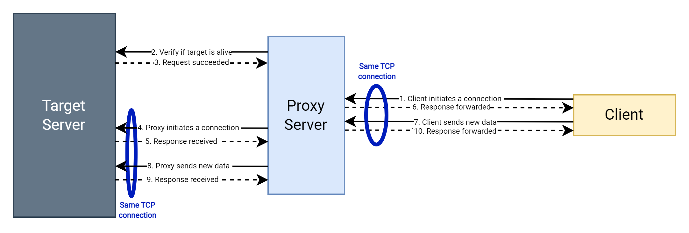
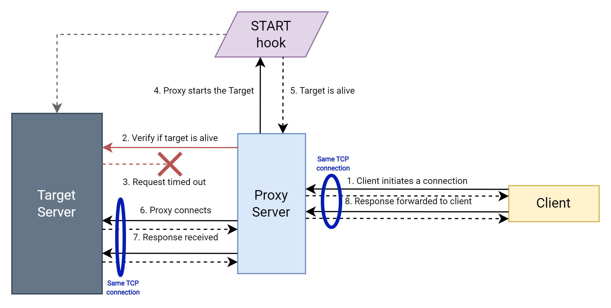
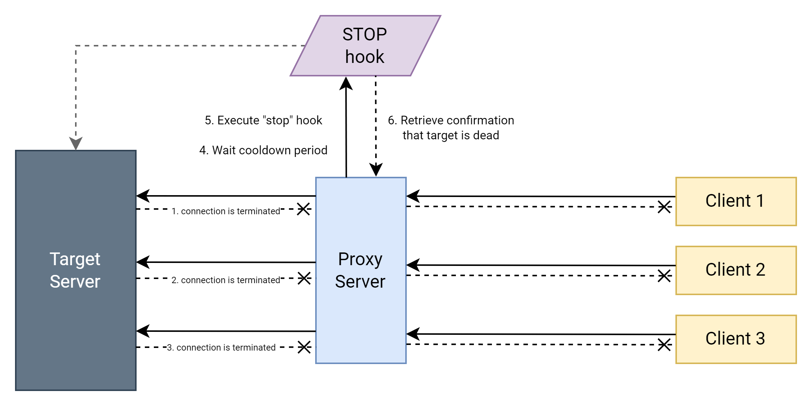

# Wake up VMs by TCP requests

This simple tool supports setups where you have an expensive server (VM) that is running 24/7, but actually serves requests only at some portions of time, and scheduled boot policies as well as other methods don't work. It is designed for the TCP applications like legacy server apps, game servers, and others.

> If you have an HTTP application that you want to be auto started/stopped based on incoming HTTP requests - _GCP AppEngine_ or a similar service will do a better job.

# Design

This tool is a TCP proxy server that intercepts all requests to your _target_ server. In case if the server is not reachable - it attempts at first to start the target server using the `start` hook (a script provided by the end user, dependend on their specific use cases). If server successfully starts - it forwards all the traffic between clients and the target. After all the clients have disconnected, it awaits a period of time and then shuts down the target server using the `stop` hook.

Below are the diagrams with a visual representation of this process.

### Case 1. Target server is alive when request arrives

<p align="center">
    
</p>

### Case 2. Target server is dead when request arrives

<p align="center">
    
</p>

### Case 3. Clients are disconnecting

<p align="center">
    
</p>

# How to set up

> Assuming your application server is running at address `192.168.100.15` at port `:8000`.

### 1. Create your `start` and `stop` hook

_Start hook_ is a script that starts your application. In example, it can spin up a Docker container, or make a call to the cloud platform to start a VM. Take a look at the provided examples in the `examples/` folder.

_Stop hook_ does the opposite - it stops the application server by any means.

For the next steps let's assume the hooks are located in the same directory and named `start.sh` and `stop.sh`.

### 2. Run proxy server

> Better wrap it into a Docker container or a systemd unit if using in production.

```bash
server.py \
    --target-ip=192.168.100.15 \
    --target-port=8000 \
    --hook-start-svc=./start.sh \
    --hook-stop-svc=./stop.sh \
    --cooldown-period=60
```

That's all, it is running and forwarding your traffic to the target app.

# Things to consider

## Throughput

Due to the design and simplicity of this tool, it doesn't provide a high throughput, however it should be enough to serve in most cases.

## Target graceful shut down

Due to the aggressive nature of the process and ignorance of the "business logic" of specific cases, you as developer or maintainer might want to make sure that your target application is configured to shut down gracefully during the standard OS shut down procedure. Loosing your data is definitely not what you want. 

## Costs

Depending on the platform where you deploy this setup, you might have additional costs for the time VM is stopped and not terminated. Consult documentation of your cloud platform for more details.
