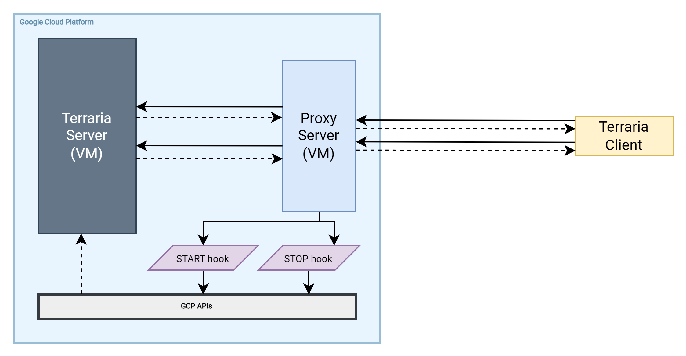

# Terraria server with auto-start/stop setup

## Architecture

    

## Description

Terraria game server is hosted on a machine of type `n2-standard-4`, and runs Terraria server as a systemd unit (attached in the `terraria-server.service` file). It is an example of application requiring manual handling to achieve graceful shut down. In this case my choise was to run it in a tmux session, and because regular SIGKILL/SIGHUP-s would kill the server without saving the game progress, it was required to hook into the tmux session and call the "exit" command on the game server before stopping it.

Proxy is deployed as a `e2-micro` instance that costs much less compared to the game server instance.

Hooks in this example start and stop the Terraria server VM instance using GCP APIs.
